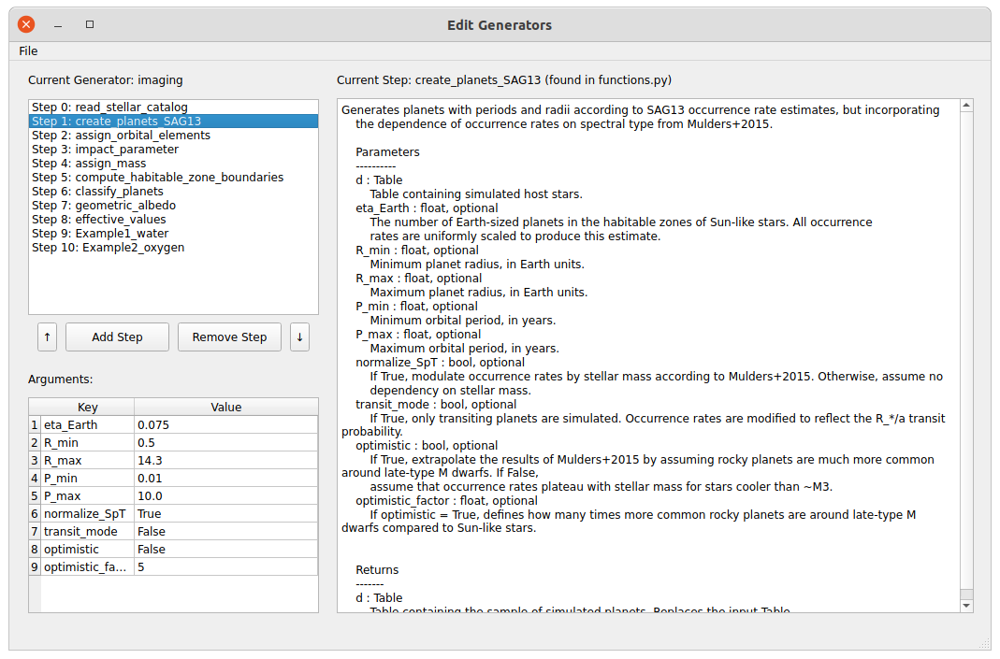
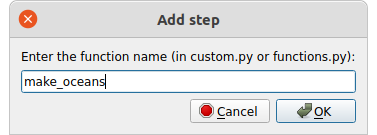
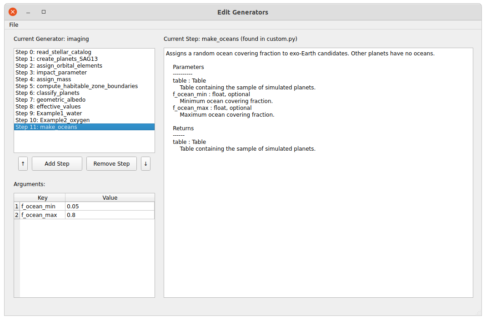
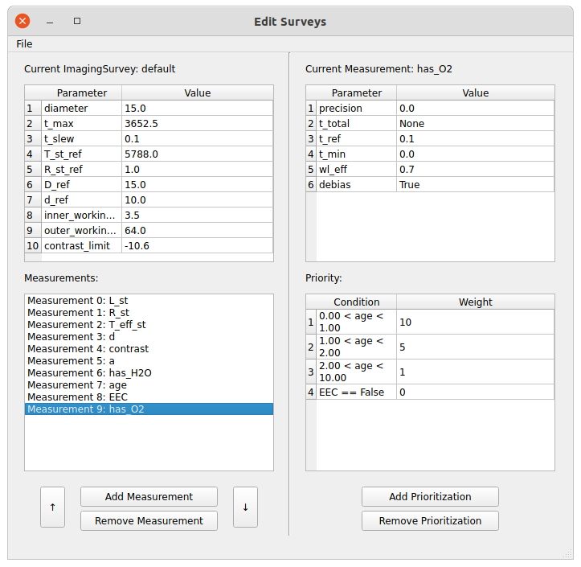
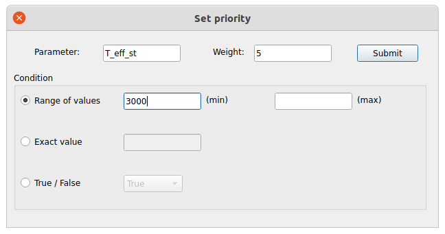

#############
Object Editor
#############

The object editor is a GUI that allows the user to edit the default :class:`~bioverse.generator.Generator` and :class:`~bioverse.survey.Survey` objects and save new configurations. It can be opened as follows:

.. code-block:: python

    from bioverse import gui
    gui.show()

Editing Generators
******************

To make changes to a Generator object, first load its associated .pkl file using File > Load. This will load the list of steps performed by the Generator into the upper left box. You can click through each step to see a description of each function and its arguments on the right:

The lower-left table shows the keyword arguments for the currently-selected function along with their current default values. To edit the default value, simply double-click and enter a new value. Note that this will update the argument value for *all* steps that accept this argument.

Editing functions
-----------------
To add a new function to the Generator, first define it in ``custom.py`` as described in :ref:`adding-steps`, then enter the name of the function using the Add Step button:

The GUI will add your function to the end of the list:

Use the arrow keys to edit the order in which functions are called. Finally, to remove a function from the Generator, use the Remove Step button.

Once you have made your changes to the Generator, you can save it using File > Save as... and use it in Bioverse:

.. code-block:: python

    # Loads my_generator.pkl
    from bioverse.generator import Generator
    generator = Generator('my_generator')

Editing Surveys
***************

To make changes to an ImagingSurvey or TransitSurvey object, first load its associated .pkl file using File > Load. You can then edit the Survey's properties in the top left and add, remove, or re-order measurements in the bottom left.

Select a measurement in the bottom left to view its details on the right side of the interface, including its key parameters (top right) and prioritization scheme (bottom right).

Target prioritization
---------------------
Each measurement assigns a weight to each potential target that determines the order in which it is observed. By default, all planets have weight = 1. In the image above, for the measurement of 'has_O2', planets with younger ages have higher weight while planets that are not exo-Earth candidates are not observed (weight = 0).

The Add Prioritization button allows you to define a new condition for assigning weight. In the following, we assign weight = 5 to planets with host star temperatures higher than 3000 K:

