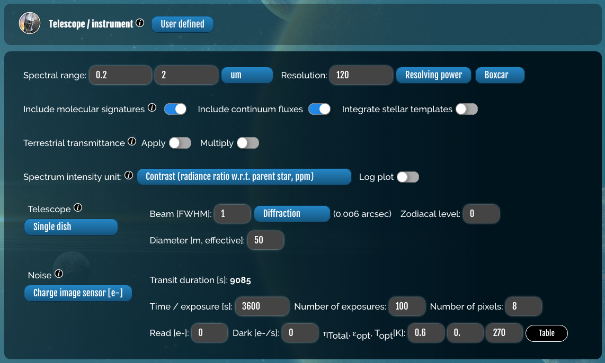
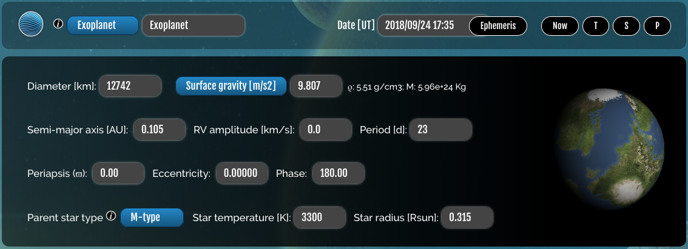
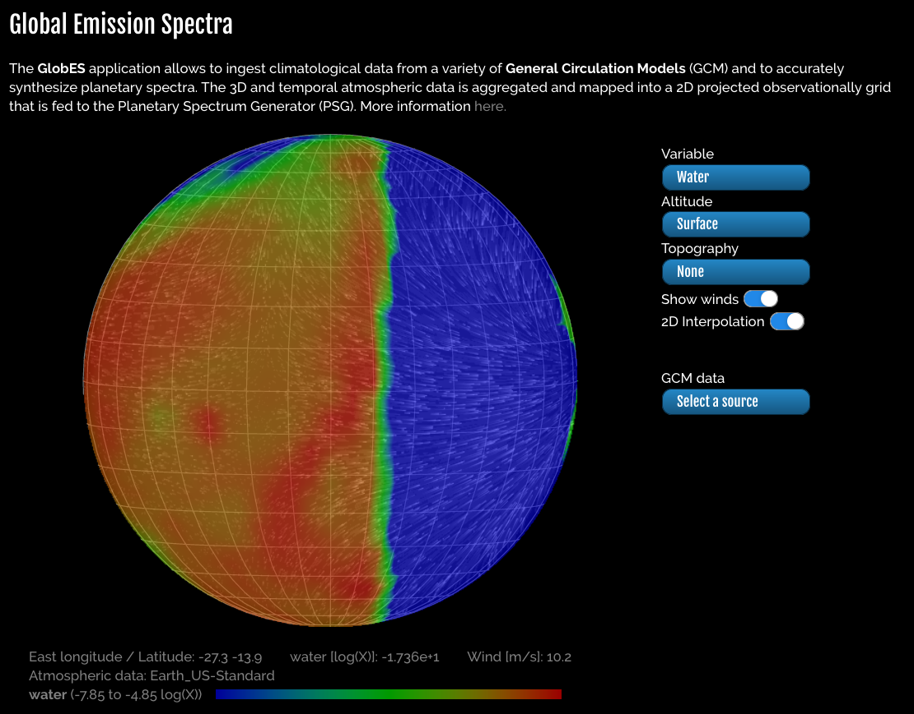
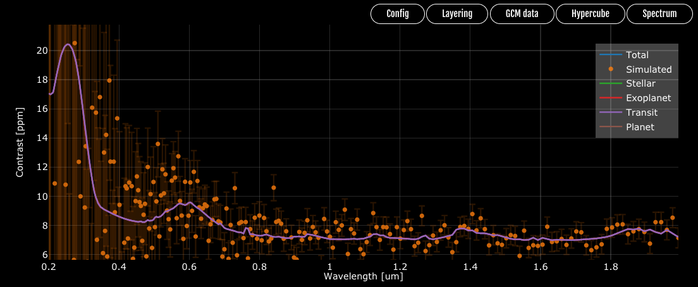
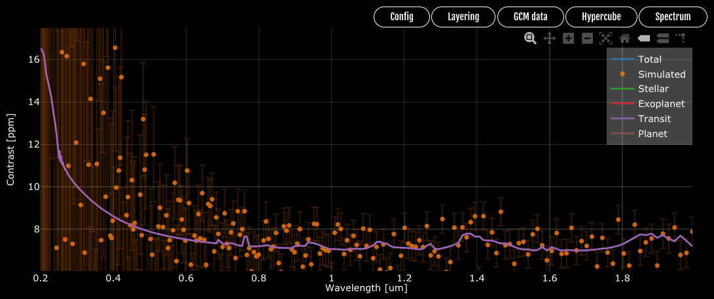

######################################
Tutorial 3: Calculating exposure times
######################################

The sample size of a simulated survey is often limited by the amount of observing time allotted for time-consuming spectroscopic measurements. To impose this limit, Bioverse requires a realistic estimate for the exposure time needed to conduct the measurement for a typical survey target, referred to as ``t_ref`` (see :ref:`reference-case` for details). For the time being, ``t_ref`` must be calculated separately using third-party tools, though future updates may bring this functionality into Bioverse.

This example will demonstrate one method of determining ``t_ref`` for the default transit survey, for which the typical target orbits a mid-M dwarf at ~50 parsecs distance. We will use the `Planetary Spectrum Generator (PSG) <https://psg.gsfc.nasa.gov/>`_ to produce simulated spectra (and noise estimates) for our desired telescope configuration.

Telescope and target properties
***********************************

To begin, navigate to PSG and load the following template containing the telescope and target parameters: ``Templates/transit_100hr.cfg``. Next, click 'Change Instrument' to navigate to the instrument parameters interface:

These values reflect the capabilties of the Nautilus Space Observatory, a space telescope array whose total light-collecting area would equal that of a single 50-meter aperture. As a basis for the noise calculation, we have set the exposure time to 100 hr (approximately 50 transit observations) and the total throughput to 60%. Finally, we have configured PSG to produce a spectrum of the transit depth in ppm.

Return to the main PSG interface and click 'Change Object' to view the properties of the planet and its star. For the default transit survey, the reference planet is an Earth analog orbiting in the habitable zone of a mid-M dwarf at a distance of 50 parsecs, and is observed at its transit midpoint:

3D atmosphere model
*******************

By default, the ``transit_100hr.cfg`` template simulates a 1D model for an Earth-like atmosphere with no clouds or hazes. In reality, clouds are expected to dilute the features of transit spectra of Earth-like planets. To accurately simulate this, we have borrowed one of the 3D GCM models from `Komacek & Abbot (2019) <https://ui.adsabs.harvard.edu/abs/2019ApJ...871..245K/abstract>`_, which contains realistic 3D abundance profiles of water and water ice clouds (as well as N2, H2O, and CO2) for a tidally-locked world whose bulk properties and host star are similar to those of the above planet. Additionally, we have manually injected Earth-like O2 and O3 abundance profiles into the model.

We can produce a simulated spectrum for this 3D model using the `GLOBES module <https://psg.gsfc.nasa.gov/apps/globes.php>`_ of PSG. Navigate to the GLOBES module and load the following file containing the GCM data: ``Templates/transit.gcm``. Select 'Water' under the first drop-down menu, then rotate the globe to view the spatial distribution of water clouds along the terminator:

The strong dayside cloud cover is a result of tidal locking, which promotes more efficient convection. High-altitude clouds near the terminator block sightlines into the lower atmosphere, reducing the amplitude of transit spectroscopy signals from species below the cloud deck.

Simulated transit spectra
*************************

Click 'Generate 3D Spectra' to simulate the transit spectrum for this model using the above telescope configuration:

The near-infrared absorption features of water vapor - typically 2-3 ppm strong - are significantly muted due to clouds. However, the ozone feature around 0.6 microns remains visible, as most of the ozone resides above the cloud deck. To estimate the detectability of this ozone feature, we must compare simulated spectra both with and without O3. Begin by clicking 'Spectrum' to download the simulated spectrum and uncertainties (save it as ``spectrum_O3.dat``). Then, click the button to change the parameters of the atmosphere, and change the ozone abundance to zero:

Save this change at the bottom of the page, return to the GLOBES module, and simulate the spectrum again:

As expected, the ozone feature has vanished. Save this spectrum under a different filename (e.g., ``spectrum_noO3.dat``).

Estimating ``t_ref``
********************

The final step is to calculate the detection SNR for the simulated 100 hr exposure time and scale that value to determine the requirements for a 5-sigma detection. We can calculate this using :func:`~bioverse.util.compute_t_ref`. Assuming the spectra are saved as ``spectrum_O3.dat`` and ``spectrum_noO3.dat``:

.. code-block:: python

    from bioverse.util import compute_t_ref

    t_ref = compute_t_ref(filenames=('spectrum_O3.dat', 'spectrum_noO3.dat'), t_exp=100, wl_min=0.4, wl_max=0.8)
    print("Required exposure time: {:.1f} hr".format(t_ref))

Output: ``Required exposure time: 73.9 hr``

To use this value in a Survey, edit the ``t_ref`` parameter of the ``has_O2`` Measurement (also specify the effective wavelength of the absorption feature as ``wl_eff``. These values should be converted into days and microns, respectively:

.. code-block:: python

    from bioverse.survey import TransitSurvey

    survey = TransitSurvey('default')
    survey.measurements['has_O2'].t_ref = t_ref / 24.
    survey.measurements['has_O2'].wl_eff = 0.6
    survey.save()

Bioverse will now scale this value to determine the exposure time required to detect (or reject) ozone for each individual planet, and prioritize planets appropriately.

